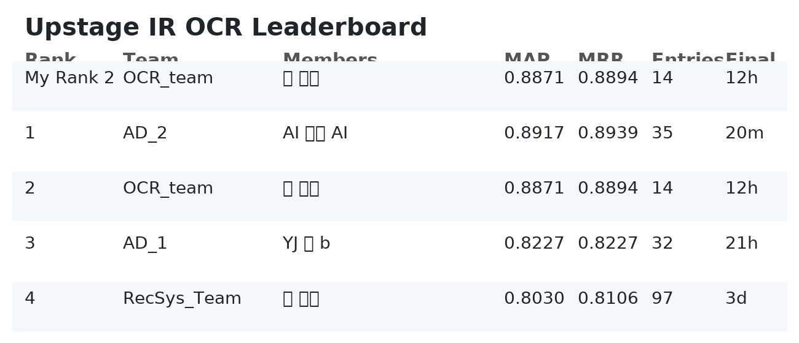

# 과학 상식 질의응답 (OCR)

Dense/BM25 하이브리드와 LLM을 결합한 RAG 파이프라인입니다. 비과학 질문을 보수적으로 차단하고, HyDE·BM25·Bi-Encoder를 통해 재현율을 확보한 뒤 Cross-Encoder로 최종 정밀도를 끌어올려 MAP을 극대화합니다.

## 팀 소개

|  |  |  |  |  |
| :--------------------------------------------------------------: | :--------------------------------------------------------------: | :--------------------------------------------------------------: | :--------------------------------------------------------------: | :--------------------------------------------------------------: |
|            [박재홍](https://github.com/woghd8503)             |            [김영](https://github.com/kimyoung9689)             |            [이찬](https://github.com/UpstageAILab)             |            [이준영](https://github.com/junyeonglee1111)             |            [김광묵](https://github.com/JackFink)             |
|                            발표자                             |                            팀원                             |                            팀원                             |                            팀원                             |                            팀원                             |

---

## 0. 빠른 시작 (TL;DR)

### 사전 준비물

- Python 3.10 이상, pip, (선택) CUDA GPU
- Elasticsearch 8.8.0 + `analysis-nori` 플러그인
- 외부 API: Upstage Solar (`SOLAR_API_KEY`), OpenAI (`OPENAI_API_KEY`)

### 설치

```bash
python -m venv .venv && source .venv/bin/activate
pip install --upgrade pip
pip install -r requirements.txt
# 프로젝트 전역에서 사용하는 추가 패키지
pip install torch torchvision torchaudio --index-url https://download.pytorch.org/whl/cu121
pip install transformers==4.44.0 rank-bm25==0.2.2 tqdm==4.66.5 numpy==1.26.4 pyyaml
```

### 환경 변수

```bash
export SOLAR_API_KEY="YOUR_UPSTAGE_SOLAR_KEY"
export OPENAI_API_KEY="YOUR_OPENAI_KEY"
export PYTHONPATH=$PWD
```

### Dense+BM25 기본 실행

```bash
python main.py \
  --documents_path data/documents.jsonl \
  --eval_path data/eval.jsonl \
  --output_path outputs/final_submission_rrf.jsonl
```

### Elasticsearch 기준 파이프라인

1. `install_elasticsearch.sh` 실행 후 새 비밀번호 생성 단계에서 `y` 입력
2. 출력된 비밀번호를 `rag_with_elasticsearch.py` 85줄 부근 `es_password`에 입력
3. 169줄 부근 `os.environ["OPENAI_API_KEY"]` 값을 세팅
4. `python rag_with_elasticsearch.py`

---

## 1. 저장소 구조

```
informationretrieval-ir_ocr
├── README.md
├── config.yaml                 # 시드, 모델, top-k 등 기본 하이퍼파라미터
├── requirements.txt
├── main.py                     # Dense + HyDE + BM25 + RRF 파이프라인
├── retriever.py                # BM25, BGE-M3 임베딩 유틸
├── reranker.py                 # BGE Cross-Encoder 래퍼
├── data_utils.py               # 멀티턴 전처리 + Solar API 래퍼
├── rag_with_elasticsearch.py   # Elasticsearch 기반 RAG 예제
├── install_elasticsearch.sh    # ES 다운로드/플러그인/비밀번호 초기화
├── data/                       # documents.jsonl, eval.jsonl (git ignore)
└── outputs/                    # 제출 파일 및 체크포인트 저장 폴더
```

원본 데이터는 `data/`에 그대로 두고, 대용량 캐시(`doc_embeddings*.pkl`)는 루트에 저장합니다. 실험 기록은 `logs/` 혹은 `wandb`/`mlflow`에 남깁니다.

---

## 2. 데이터 설명

- **documents.jsonl**: 약 4.2k개의 과학 상식 문서 (`docid`, `src`, `content`).
- **eval.jsonl**: 220개의 멀티턴 대화(`msg`)와 `eval_id`.
- 약 20개의 질의는 의도적으로 비과학 질문입니다. 해당 쿼리에서 `topk=[]`를 유지하면 MAP 만점을 얻으므로 분류기가 매우 중요합니다.

`data_utils.extract_category_from_src`가 문서를 카테고리로 태깅하여 이후 분석에 활용합니다.

---

## 3. 파이프라인 아키텍처

| 스테이지 | 파일 / 함수 | 핵심 내용 |
| --- | --- | --- |
| 질의 전처리·의도 판별 | `data_utils.preprocess_queries` | 멀티턴 사용자 메시지 병합, Solar-pro 결과를 `query_classifications.json`으로 캐시, 간단한 규칙 기반 인사 필터. |
| HyDE 생성 | `data_utils.generate_hypothetical_document` | 과학 질문일 때 가상 문서를 만들어 Dense 재현율 향상. |
| Dense 검색 | `retriever.BGEBiEncoder`, `retrieve_documents` | `BAAI/bge-m3` 임베딩, 코사인 유사도, `doc_embeddings_bge_m3.pkl` 캐시. |
| BM25 검색 | `retriever.BM25Retriever` | `bert-base-multilingual-cased` 토크나이저 + `rank_bm25`. |
| 융합 | `main.rrf_fusion` | Dense, HyDE, BM25 후보를 Reciprocal Rank Fusion으로 결합. |
| 재순위 | `reranker.CrossEncoderReranker` | `BAAI/bge-reranker-v2-m3` 로그릿으로 최종 Top-3 선택. |
| 제출 포맷 | `main.py` | `eval_id`, `standalone_query`, `topk`, `references` JSONL 출력. (필요 시 `rag_with_elasticsearch.py`에서 답변 생성 가능) |

MAP 전략 요약

1. **재현율 게이트**: Dense + HyDE + BM25로 OCR 잡음을 방어하며 최소 한 개의 정답 문서를 풀에 포함.
2. **정밀도 게이트**: Cross-Encoder가 최종 3개만 남겨 평가 로직과 정렬.
3. **가드레일**: `is_science=False`이면 `topk`를 비워 MAP 패널티를 회피.

---

## 4. 실행 방법

### 4.1 기본 하이브리드 파이프라인 (main.py)

| 플래그 | 설명 | 기본값 |
| --- | --- | --- |
| `--documents_path` | 문서 JSONL 경로 | `data/documents.jsonl` |
| `--eval_path` | 평가 쿼리 경로 | `data/eval.jsonl` |
| `--output_path` | 제출 파일 경로 | `final_submission_rrf.jsonl` |
| `--top_k_retrieval` | 각 경로에서 가져올 후보 수 | `50` |
| `--top_k_fusion` | RRF 이후 유지할 후보 수 | `100` |
| `--top_k_final` | 최종 제출 doc 개수 | `3` |
| `--recompute_embeddings` | Dense 임베딩 강제 재계산 | `False` |
| `--skip_classification` | 모든 쿼리를 과학으로 간주 | `False` |
| `--use_hyde/--no_hyde` | HyDE 경로 on/off | `True` |
| `--use_bm25/--no_bm25` | BM25 경로 on/off | `True` |

Ablation 예시 (HyDE 비활성화, 임베딩 재생성, 출력 경로 변경):

```bash
python main.py \
  --recompute_embeddings \
  --no_hyde \
  --documents_path data/documents.jsonl \
  --eval_path data/eval.jsonl \
  --output_path outputs/baseline_no_hyde.jsonl
```

### 4.2 Elasticsearch RAG (rag_with_elasticsearch.py)

1. `bash install_elasticsearch.sh` → ES 다운로드 + Nori 설치 + 데몬 기동 + 비밀번호 재설정
2. `es_password`(85줄) 갱신
3. 환경 변수 혹은 소스(169줄)에서 `OPENAI_API_KEY` 지정
4. `python rag_with_elasticsearch.py`
   - `test` 인덱스에 Sparse/Nori + Dense/KR-SBERT를 모두 색인
   - `sparse_retrieve`, `dense_retrieve` 헬퍼 제공
   - 함수 호출 기반 `answer_question`으로 검색 필요 여부 판단 후 답변 생성

자체 호스팅 검색 엔진이 필요할 때 이 경로를 사용합니다.

---

## 5. 설정 & 실험 추적

- 모든 기본 하이퍼파라미터는 `config.yaml`에 명시되어 있으며 CLI 실행 시 참고합니다.
- 재현성 확보를 위해 랜덤 시드를 고정하세요.

```bash
export PYTHONHASHSEED=42
export TOKENIZERS_PARALLELISM=false
```

```python
import random, numpy as np, torch
random.seed(42)
np.random.seed(42)
torch.manual_seed(42)
torch.cuda.manual_seed_all(42)
```

- 주요 실험은 `wandb` 혹은 `mlflow`에 기록 (`WANDB_PROJECT`, `WANDB_RUN_GROUP` 등 설정)하면 JSONL 출력의 `topk`/`references` 정보를 그대로 추적할 수 있습니다.

---

## 6. 개발 팁

- `query_classifications.json`은 Solar 응답을 캐시합니다. 프롬프트 변경 시 파일을 삭제하고 다시 생성하세요.
- `doc_embeddings_bge_m3.pkl` 파일은 1GB 이상이 될 수 있습니다. 저장소 정책상 업로드가 어렵다면 필요 시마다 재생성하세요.
- GPU 메모리가 부족하면 `BGEBiEncoder.encode` 및 `CrossEncoderReranker.rerank`의 `batch_size` 값을 낮추세요.
- BM25 토크나이즈 비용이 크면 토큰화된 문서를 직렬화(`pickle`)해 재사용할 수 있습니다.

---

## 7. 대회 맥락 및 성과

- **목표**: 과학 질문에는 정확한 문서를, 비과학 질문에는 빈 `topk`를 반환하여 MAP 극대화.
- **타임라인**: 2025-11-14 10:00 → 2025-11-27 19:00 (KST)
- **리더보드**: 최종 제출 기준 MAP 0.8871 / MRR 0.8894로 2위를 기록했습니다.



---

## 8. 트러블슈팅

- **ES 비밀번호 분실**: `sudo -u daemon elasticsearch-8.8.0/bin/elasticsearch-reset-password -u elastic`
- **`SSL: CERTIFICATE_VERIFY_FAILED`**: `rag_with_elasticsearch.py`에 명시된 CA 경로(`./elasticsearch-8.8.0/config/certs/http_ca.crt`)를 그대로 사용하세요.
- **OpenAI 쿼터 에러**: 올바른 `OPENAI_API_KEY`를 지정하거나 `OPENAI_BASE_URL`을 통해 Azure 등 대체 엔드포인트를 연결하세요.
- **Solar API Rate Limit**: 규칙 기반 필터로 단순 인사를 미리 제거하고, 캐시된 분류 결과를 재사용하세요.

---

## 9. 향후 계획

- `rag_with_elasticsearch.py`의 답변 생성을 메인 파이프라인 JSON 출력과 통합
- ColBERT 등 멀티 벡터 인덱스를 활용한 OCR 강건성 향상
- Hydra 기반 설정 로딩으로 `config.yaml` 자동 적용
- HyDE 다중 변형 생성 후 공동 재순위 전략 실험
